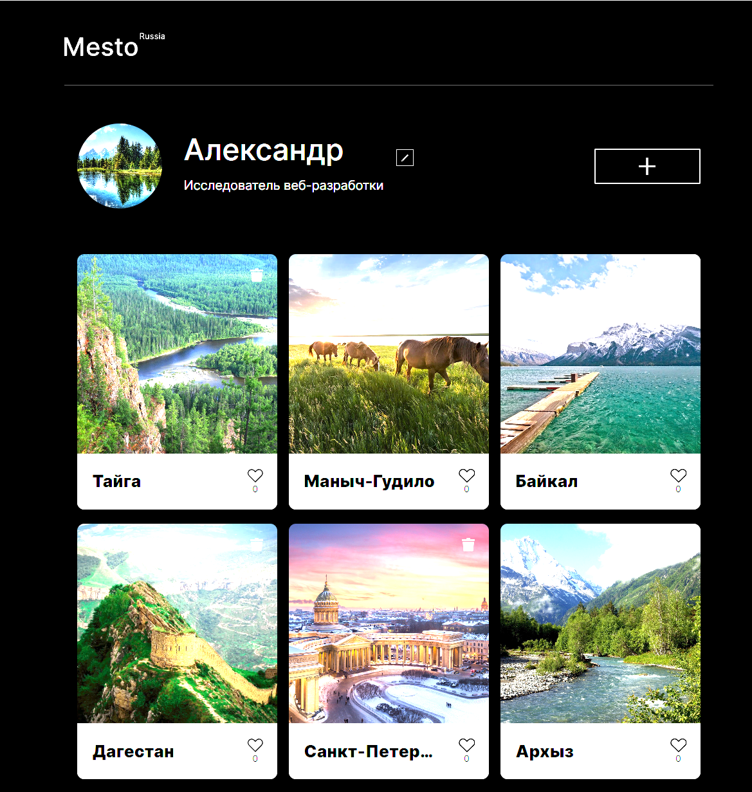

## Проект: Место



___
## Обзор
Адаптивная верстка веб-страниц
Функционал:
 - Редактирование данных профиля
 - Добавление карточек
 - Удаление карточек
 - Лайк карточки
 - Плавное открытие и закрытие модального окна
 - Валидация форм для редактирования профиля и добавления карточек
___
## Использованные технологии
* HTML
* CSS ( _flex_ и _grid_, медиазапросы)
* JS (модульный подход с использованием import, export)
* Webpack
* Figma
* Картинки
* Api Fetch (Method: PATCH, GET, PUT, DELETE, POST)
___
## Макет

* [Ссылка на макет в Figma](https://www.figma.com/file/2cn9N9jSkmxD84oJik7xL7/JavaScript.-Sprint-4?node-id=0%3A1)
* [Ссылка на макет в Figma при ошибке валидации](https://www.figma.com/file/kRVLKwYG3d1HGLvh7JFWRT/JavaScript.-Sprint-6?node-id=1124%3A73)
* [Демоверсия страницы](https://eukleidesrus.github.io/mesto-project/)

___
## Локальная установка и запуск
```
Клонировать репозиторий
  git clone git@github.com:eukleidesrus.github.io/mesto-project.git

Войти в проект через консоль
  cd mesto-project

Установить зависимости
  npm install

Старт сервера
  npm run dev
```

### Этот проект выполнен в рамках учебной программы.
